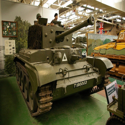
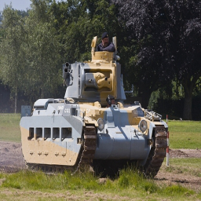
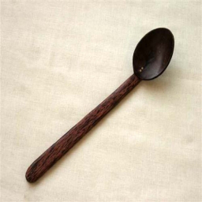

# SEM-PCYC

This is the repository for generating some key results of our CVPR 2019 paper:

**Anjan Dutta and Zeynep Akata. Semantically Tied Paired Cycle Consistency for Zero-Shot Sketch-based Image Retrieval, CVPR, 2019**

* Zero-Shot Sketch-based Image Retrieval Demo

* Zero-Shot Sketch-based Image Retrieval Results

                    
                    
                    
                    
                    

### Models

### Author
* [Anjan Dutta](https://sites.google.com/site/2adutta/) ([@AnjanDutta](https://github.com/AnjanDutta))