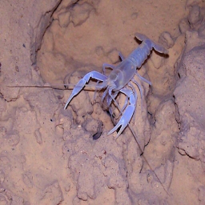
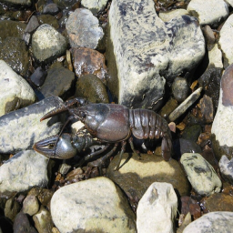
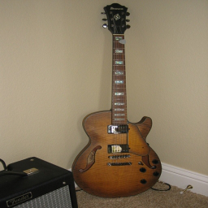
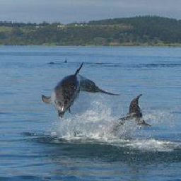
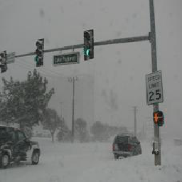
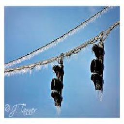
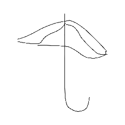
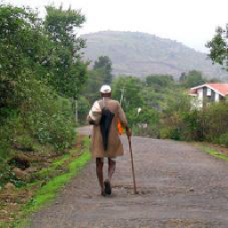
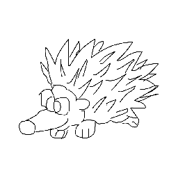

# SEM-PCYC

[PyTorch](https://pytorch.org/) | [Arxiv](https://arxiv.org/abs/1903.03372)

<p align="center">

</p>

PyTorch implementation of our SEM-PCYC model for zero-shot sketch-based image retrieval:  
[Semantically Tied Paired Cycle Consistency for Zero-Shot Sketch-based Image Retrieval](https://arxiv.org/abs/1903.03372)  
[Anjan Dutta](https://sites.google.com/site/2adutta/), [Zeynep Akata](https://ivi.fnwi.uva.nl/uvaboschdeltalab/people/zeynep-akata/)  
[CVPR, 2019](http://cvpr2019.thecvf.com/)

## Demo Video

<p align="center">

</p>

## Live Demo

<p align="center">
<a href="http://158.109.8.91/sketch_retrieval"></a>
</p>

## Retrieval Results

#### Sketchy

<p align="center">
                    <br>
                    <br>
                    <br>
                    <br>
                    <br>
</p>

#### TU-Berlin
        
<p align="center">
                    <br>
                    <br>
                    <br>
                    <br>
                    <br>
</p>

## Prerequisites

* Linux (tested on Ubuntu 16.04)
* NVIDIA GPU + CUDA CuDNN
* 7z 
```bash
sudo apt-get install p7zip-full
```
## Getting Started

### Installation
* Clone this repository
```bash
git clone https://github.com/AnjanDutta/sem-pcyc.git
cd sem-pcyc
```
* Install the requirements (not checked)
```bash
pip3 install -r requirements.txt
```
* Update [config.ini](https://github.com/AnjanDutta/sem-pcyc/blob/master/config.ini) (see example)
```bash
[<host>]
path_dataset = <where all the datasets will be downloaded>
path_aux = <where all the auxiliary folders and files will be saved>
```
### Download datasets
* Sketchy
* TU-Berlin
```bash
bash download_datasets.sh
```
### Download pretrained models
* Sketchy
    * sketch
    * image
    * hieremb-jcn + word2vec-google-news
* TU-Berlin
    * sketch
    * image
    * hieremb-path + word2vec-google-news
```bash
bash download_models.sh
```
### Test
##### Sketchy
```bash
python3 src/test.py --dataset Sketchy_extended --dim-out 64 --semantic-models hieremb-jcn word2vec-google-news
```
##### TU-Berlin
```bash
python3 src/test.py --dataset TU-Berlin --dim-out 64 --semantic-models hieremb-path word2vec-google-news
```
### Train
##### Sketchy
```bash
python3 src/train.py --dataset Sketchy_extended --dim-out 64 --semantic-models word2vec-google-news --epochs 1000 --early-stop 200 --lr 0.0001
```
##### TU-Berlin
```bash
python3 src/train.py --dataset TU-Berlin --dim-out 64 --semantic-models word2vec-google-news --epochs 1000 --early-stop 200 --lr 0.0001
```
### Citation
```
@inproceedings{Dutta2019SEMPCYC,
author = {Anjan Dutta and Zeynep Akata},
title = {Semantically Tied Paired Cycle Consistency for Zero-Shot Sketch-based Image Retrieval},
booktitle = {CVPR},
year = {2019}
}
```

## Author
* [Anjan Dutta](https://sites.google.com/site/2adutta/) ([@AnjanDutta](https://github.com/AnjanDutta))